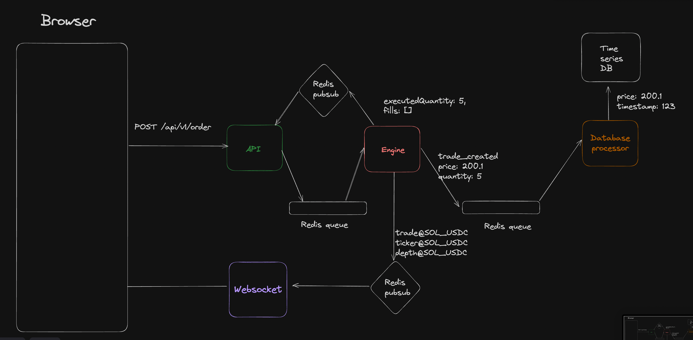

# Exchange

This project is a fully-featured cryptocurrency exchange platform designed to handle high-frequency trading and real-time market interactions. It includes an API server for user requests, a memory-based engine for order book management and balance tracking, and a WebSocket server for live updates. The platform integrates a DB Processor for persistent data storage, a frontend built with Next.js, and a Market Maker for liquidity. Redis is used for queuing and pub/sub messaging, while TimescaleDB handles time-series data for advanced kline charting. Together, these components create a robust, scalable trading environment for both developers and users.

## Tech Stack
- Typescript
- Monorepo/ Turborepo
- Next.js 
- Expressjs
- Redis
- Redis Pub Subs
- Websockets
- Timescale Db
- Docker
- CI/CD
- Husky

## Architecture



1. <span style="color: lightgreen;">API - An API Server the user sends HTTP requests to</span>
2. <span style="color: red;">Engine - Runs various market orderbooks, stores user balances in memory</span>
3. <span style="color: #9B59B6;">Websocket - Websocket server that user subscribes to real time events from</span>
4. <span style="color: orange;">DB Processor - Processes messages from the `Engine` and persists them in the DB</span>
5. Frontend - NextJS app (same as last week, only the URLs would change)
6. Market maker (mm) - Places random orders to keep the book liquid
7. Redis - Queue and pub sub
8. TimescaleDB - Creates buckets of klines based on price feed

## Running the project locally

There is a [docker-compose.yml](./docker-compose.yml) in each of the services fill in the environment variables after that in the project's root dir run

```shell
git clone https://github.com/Ayush272002/Exchange.git
cd Exchange
docker-compose up
```

## Contributing

Contributions are welcome! If you have suggestions for new features, bug fixes, or improvements, please fork the repository and submit a pull request. For major changes, please open an issue first to discuss what you would like to change.

## License

This project is licensed under the MIT License - see the [LICENSE](LICENSE) file for details.

## Contact

If you have any questions or suggestions, please feel free to contact.